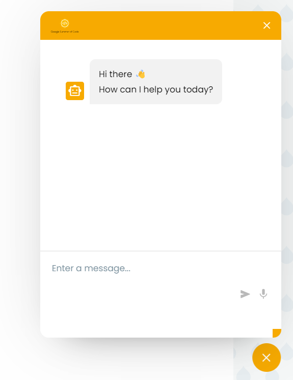
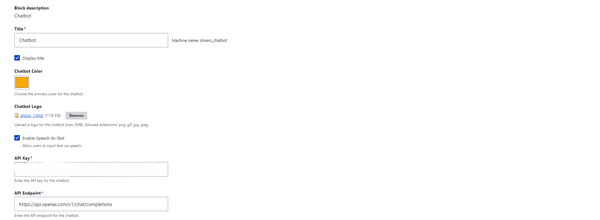

## GPT-Based Chatbot Integration for Drupal

This project aims to integrate AI capabilities into Drupal websites to provide analytics and insights for enhancing user experience and driving website growth. Leveraging OpenAI-based AI, the project will analyze user behavior, chatbot interactions, and engagement metrics, offering valuable insights to Drupal users, developers, and admins. It was developed as part of a Google Summer of Code 2024 proposal. 

## Description

The Drupal AI Chatbot module leverages OpenAI's language models to add an intelligent chatbot to your Drupal site. It analyzes user interactions and provides real-time assistance, information retrieval, and interactive experiences for website visitors.

Key features:
- AI-powered chatbot interface  
- Customizable chatbot appearance
- User behavior and engagement analytics
- Insights for improving user experience
- Easy integration with existing Drupal sites

For a video demonstration of the chatbot, please visit: https://youtu.be/qdr75LVmHtc

## Installation

1. Download and place the module folder in your Drupal installation's `modules` directory.
2. Enable the module through the Drupal admin interface (Extend > AI Chatbot).
3. Configure the module settings at Configuration > AI Chatbot Settings.

## Configuration

1. Obtain an API key from OpenAI.
2. Enter your API key in the module configuration page.
3. Customize the chatbot appearance (color, logo, etc.)
4. Enable or disable specific chatbot features as needed.

## Usage

Once configured, the chatbot will appear as a small icon in the corner of your Drupal site. Visitors can interact with it to ask questions or get assistance.

Admins can view analytics and insights from chatbot interactions in the Drupal admin dashboard.

## Chatbot Interface

The chatbot appears as an unobtrusive widget that expands when clicked:

  

## Customization

The module provides a customization interface where you can adjust various aspects of the chatbot:

  

You can set:
- Chatbot title
- Primary color
- Logo
- Enable/disable speech-to-text
- API key and endpoint

## Requirements

- Drupal 9.x or 10.x
- PHP 7.4+
- OpenAI API key

## Support

For issues, feature requests or support:
- Open an issue on the [project page](https://git.drupalcode.org/sandbox/ubulinux-3452104)
- Contact the maintainer

## Contributing

Contributions are welcome! Please follow the standard Drupal coding standards and submit pull requests for any enhancements.

## Acknowledgements

This project was developed as part of Google Summer of Code 2024 under the mentorship of Ms. Anushri Kumari (https://www.drupal.org/u/anushrikumari) from the Drupal community.

## License

This project is licensed under the MIT License.